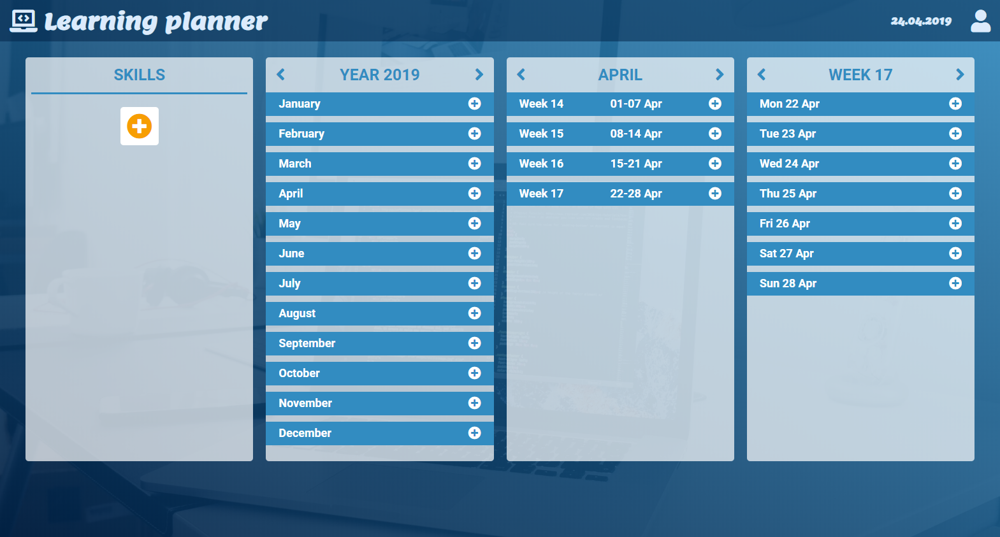
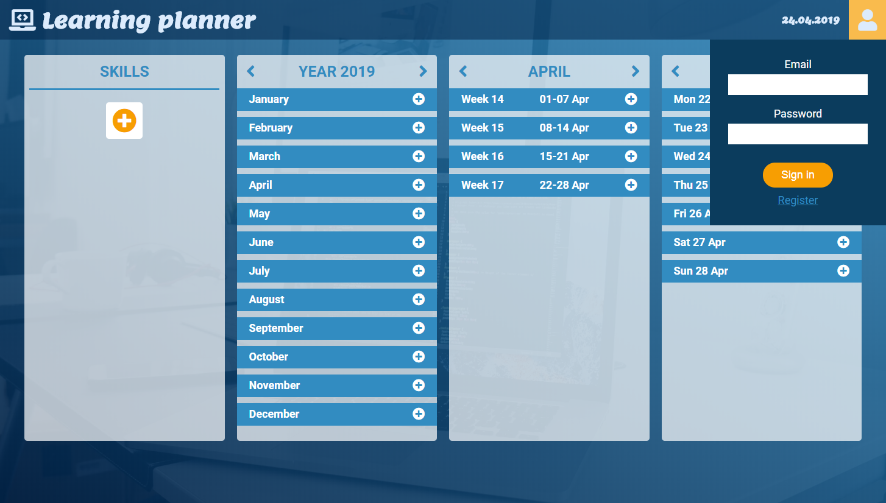
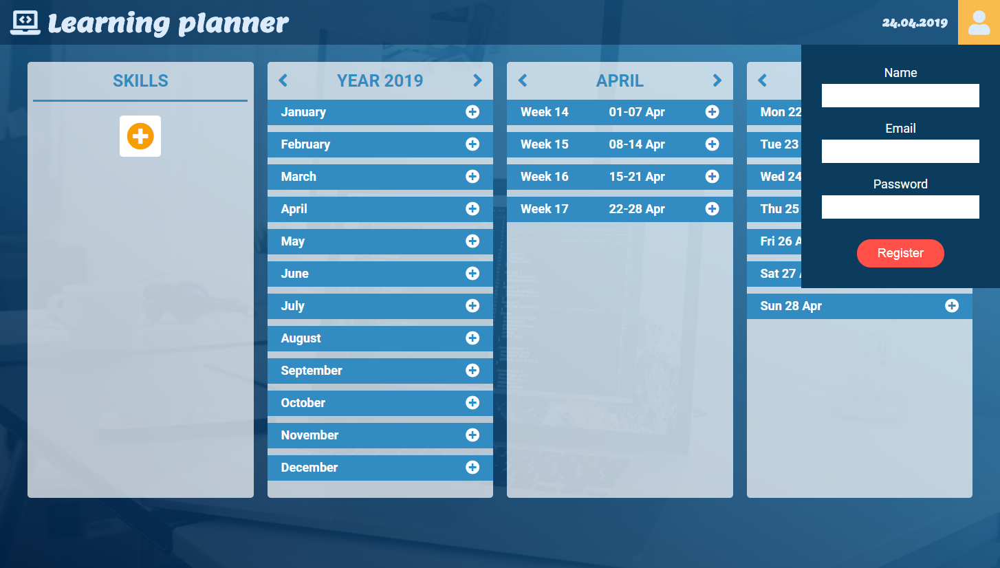
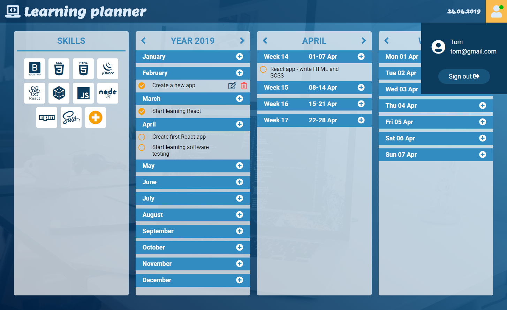
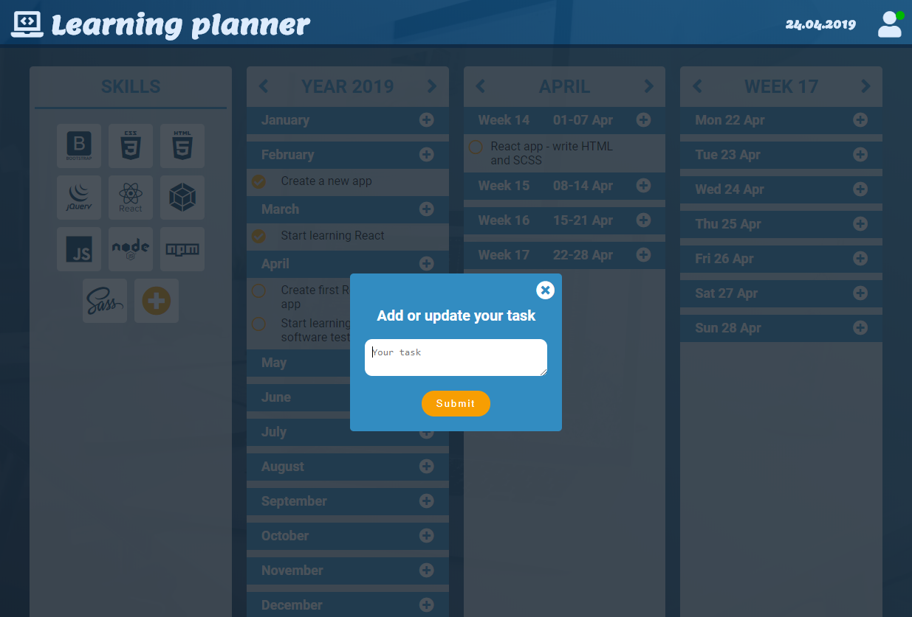
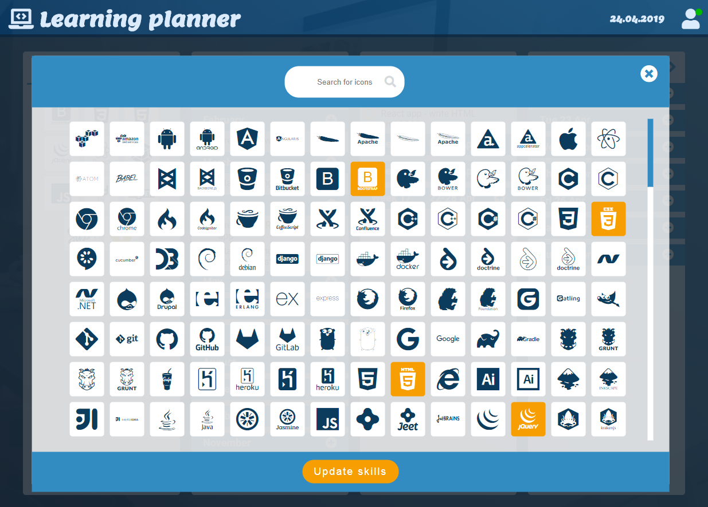

#  Learning planner app

My own app made from scratch with Vanilla JavaScript, Node.js, PostgreSQL. Deployed on Heroku.

## Table of contents :clipboard:
* [General info](#general-info--information_source)
* [Screenshots](#screenshots--camera)
* [Technologies](#technologies--computer)
* [Features](#features--bulb)
* [Status](#status--question)

## General info  :information_source: 
Learning planner app is intended mostly for those learning programming. It makes it easier to plan next learning steps.
The app consists of four sections.
In the first one it is possible to pick  icons representing  the gained skills. These can be selected from the popup. 
The remaining three sections are for planning monthly, weekly and daily tasks.

## Screenshots  :camera: 

## Technologies  :computer: 
* HTML5 
* SCSS 
* JavaScript ES6 
* NPM 6.9.0 
* Webpack 4.27.1 
* Babel / core 7.2.2 
* Server: Heroku 
* Node.js
* Express.js
* PostgreSQL

## Features  :bulb:
* Registering and signing in
* Adding gained skills 
* Setting monthly, weekly and daily tasks
* Editing and deleting single tasks

## Status  :question:
Project no longer continued. :zzz: 
